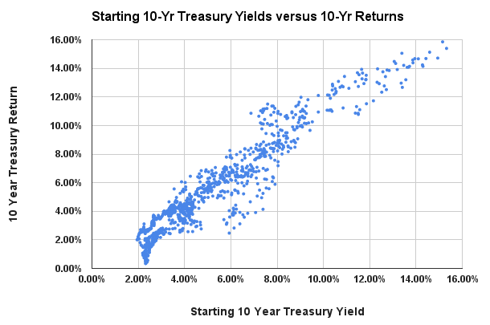

_NOTE: This is a summary of 2020 research that has been put on hold. [Here's](https://github.com/FlanaganSe/Mean-Variance-Project) a github for generating the calculations. I may return to this project at a later date._

## Improving returns with the Kelly Criterion

The Kelly Criterion is a concept in probability theory for determining optimal sizes for bets. When applied to financial markets the theory, even when used poorly, may be able to improve long-term returns. One easy strategy for this is via adaptive asset allocation and a best-attempt at constantly re-calculating the kelly criterion.

### How is this done?

1. Choose non-correlating assets
2. Predict returns, correlations, and standard deviations for each asset
3. Use the Kelly Criterion to calculate the optimal portfolio
4. Recalculate and rebalance as market conditions change

## Does this work?

Cannot say for sure -- using past results to predict the future is a near-futile effort.

The bread-and-butter of the strategy comes from the predictability of asset standard deviations and correlations. Both exhibit momentum and can be reasonably predicted using recent historical data. Leverage can then be applied during periods of favorable market conditions (strong negative correlations / low volatility) and vice-versa for unfavorable market conditions.

The benefit of this type of strategy mainly comes from its down-side protection. Unless you are leveraging then the strategy will likely underperform during bull markets but should fall far less during recessions / market crashes.

## Good Assets:

- Non-Leveraged: VTI (US Market); VGLT (19Y bond); GLDM (Gold)
- Leveraged: UPRO (3x S&P); TMF (3x TLT)

## Predictions:

#### Returns:

**SPY:** Estimated using Damodaran's ERP calculations

- Research: Equities markets have had daily mean reversion since 2000 but show 10-month momentum. May be worth considering raising / lowering return estimates based on these factors.

**TLT:** Equal to current treasury yeild rate.

- Research: When yields are under 3% it may be better to predict returns slightly lower than current yields

#### Volatility:

Volatility estimates are made by averaging the 5-year volatility, 20-day historical volatility (HV) and 30-day implied volatility (IV).

#### Correlations:

Correlation estimates are made by averaging the 10-day, 40-day, and X-day correlations. X is the number of days since the last substantial FED regime change (Jan 31st 2021).

## Potential Additional Funds:

To be considered funds must have a low expense ratio, high trading volume, low bid/spread rate, and low correlations with other portfolio assets. Having predictable long-run returns and being heavily traded on the options market are a plus. They must also provide significant benefit as it is preferable to have a bias toward simplicity.

- **Equities:** There may be benefits to diversifying equities beyond VTI. Replacing some VTI with emerging markets (VWO), developed markets (VEA) or small cap value (VBR, IJS) may be beneficial.
- **Bonds:** Intermediate (VGIT) or Short (VGSH) treasuries may be beneficial at times when the portfolio calls for cash. VGSH can often have differing equity correlations.

**Bad Funds:**

- Commodity Funds (PDBC), despite non-correlations, are not worth considering because they have high expenses, low trade volume, poor historical performance, and added inefficiencies from trading futures.
- Municipal bonds (MUB) are not worth adding unless high income and living in NY / Cali
- TIPS (SCHP) are mostly not worth considering over treasury bonds.
- Total bond funds (BND) are not worth it compared to treasuries in an equity-heavy portfolio. International bonds (IAGG, BNDX) may be worth considering but do not seem greatly beneficial.
- Real Estate (VNQ) is not worth considering compared to overweighting small-cap value funds (VBR, IJS). SCV funds are ~10% REtITS, provide similar diversification, and better risk-adjusted historical returns.

## Calculating the rebalancing bonus:

- For each asset (X) the rebalance bonus is estimated with: **SD² / 2 \* (1 - corr) \* (1 - %X)**

#### Cannot find the rebalancing bonus?

Rebalance bonus is relative to Markowitz calculation of return. For a portfolio of 50% equities (8% per year) and 50% cash (0% per year), the markowitz return is 4%. However w/o rebalancing the long-term return will be >4% because of the exponential growth of the equities portion.

- If one asset has too great of a return relative to another then it is not worth rebalancing except to reduce risk. You will simply be reducing momentum of the growing asset and reducing portfolio returns. This explains why rebalancing anything with equities over the past ~10 years appears horrible in backtesting.
- However rebalancing to reduce risk and then leveraging to improve returns may be an even more advantageous long-term strategy.

#### Further Research:

- **Momentum and Mean Reversion:** Markets always either have momentum (increases lead to further increases) or mean-reversion (rises lead to falls back to the mean). Predicting when or how markets will display one/the other will improve long-term returns (and vice-versa for wrong predictions).
- **Optimal Number of Days:** Research the optimal number of recent days to use for predicting future asset correlations / volatility. Using more days will reduce noise but may risk being late in adapting to changing market conditions.
- **Implied Volatility:** Should efforts be made to smooth out the implied volatility calculation? It can change drastically within a single day so perhaps a rolling average or longer IV calculation would simplify the strategy?
- **Bitcoin ETF:** Bitcoin or cryptocurrency may be worth considering in this strategy. It can be argued its use is comparable to that of gold and it has similar market correlations.
